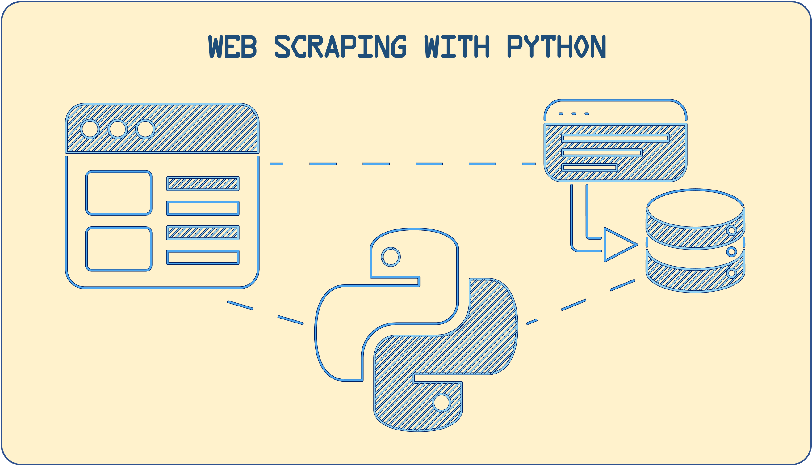
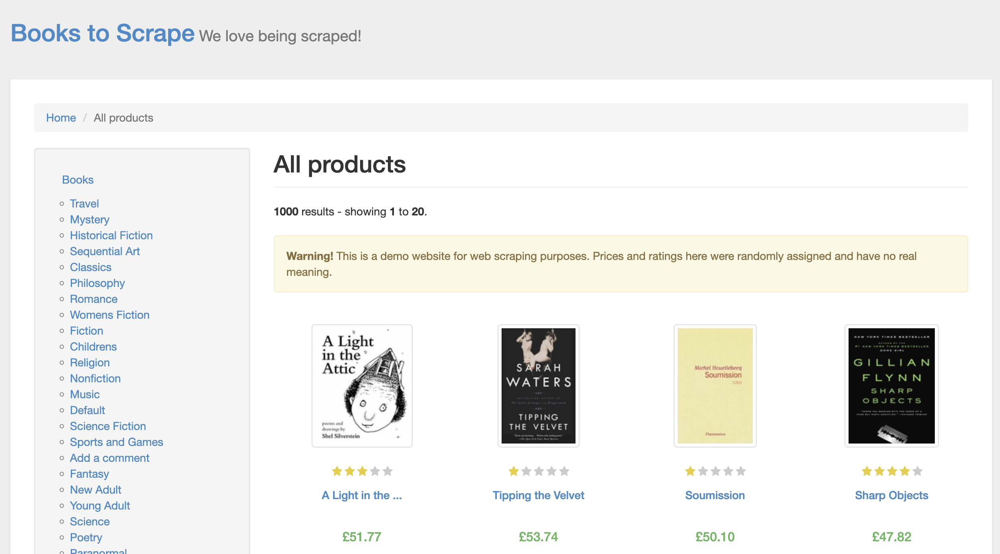

# Building a Web Scraper with Python and BeautifulSoup Library



Hey folks! This week I decided to learn a little bit about Web Scraping. You can check my article about a brief introduction of Web Scraping and how we can do this with Python on my Medium's Article here:

Link: 
&nbsp;
### **Project's Scenario:**
This project is meant to create a web scraper with Python on fictional web site called "Book to Scrape". This website contains information about books per different categories and the idea of this project is to extract the information of each book available on the website.



After scraping the website, we can export the data into Json, csv, txt files or into a database. In this case, I stored it on a csv file.
&nbsp;
### **Requirements:**
&nbsp;
1- You need to have python (obviously)

2- Install `BeautifulSoup`
```bash
pip3 install beautifulSoup4
```
3- On your Python code you need to import it
```python
import BeautifulSoup
```
&nbsp;
### **Some common methods:**
Let's supose that you want to scrap a website and you have a URL. The website has the following HTML code:
```html
<!DOCTYPE html>
    <head>
        <meta charset="utf-8">
        <title>My Website</title>
    </head>
    <body>
        <div id='main-content'>
            <p>
                Hello World! This is the list of movies I like:
            </p>
            <ul>
                <li class='movie'>Avatar</li>
                <li class='movie'>Avengers Endgame</li>
                <li class='movie'>Midnight in Paris</li>
                <li class='movie'>Akira</li>
            </ul>
        </div>
    </body>
</html>
``` 

In your Python file, you can do the following:
```python
import request
import BeautifulSoup

url = [YOUR URL]
page = requests.get(url)
soup = BeautifulSoup(page.content, "html.parser")
```

Your `soup` variable will hold the entire HTML code. The idea is to "move" inside your HTML using `find` and `find_all` functions

```python
#Looking any div element
div_main_content = soup.find('div',id='main-content')

#Looking any <li> element which its parent, grandparent, great-grandparent, etc is the div element (id = 'main-content')
li_elements = div_main_content.find_all('li',class_='movie', recursive=True)

for li_element in li_elements:
    print(li_element.text)
```
The result will be:
```
Avatar
Avengers Endgame
Midnight in Paris
Akira
```
---

### Follow me on:
 GitHub: https://github.com/luismirandad27

&nbsp;
 Medium: https://medium.com/@lmirandad27

&nbsp;
 LinkedIn: https://www.linkedin.com/in/lmirandad27/
